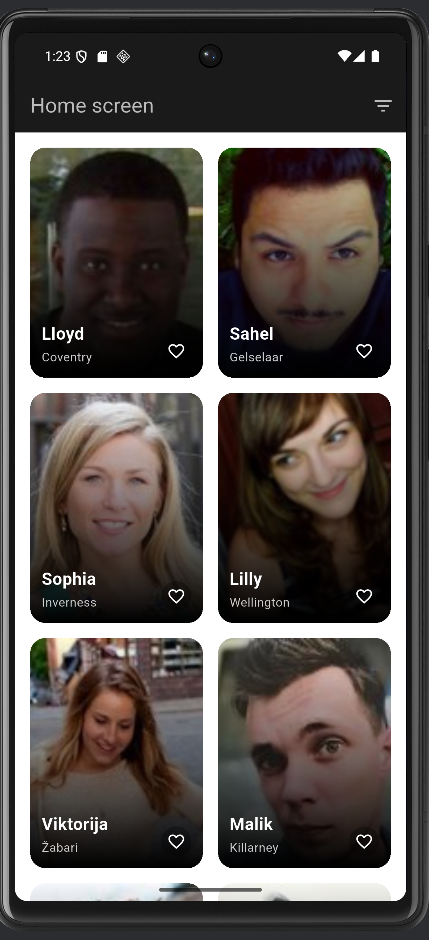
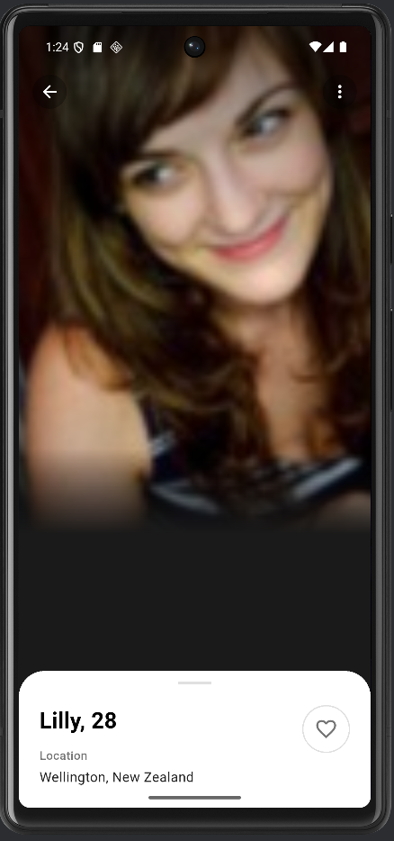

# 🚀 Profile Explorer App - Flutter Assignment

A beautifully designed Flutter application that fetches and displays random user profiles from the RandomUser API. Built with Clean Architecture, MVVM pattern, and smooth animations for an exceptional user experience.


---

## 📱 Screenshots

<!-- Add your app screenshots here -->
|Home Screen | Profile Detail Screen |
|||

---

## ✨ Features

### Core Features ✅
- 🌐 Fetch 20 random user profiles from RandomUser API
- 📊 Grid layout displaying profile cards (2 columns)
- 🖼️ Profile detail screen with full user information
- ❤️ Like/Unlike functionality synced across screens
- ⏳ Loading states with shimmer effect
- ⚠️ Error handling with retry functionality
- 🏗️ Clean Architecture (Data, Domain, Presentation layers)
- 📐 MVVM architecture with Provider state management

### Bonus Features 🎁
- ✨ **Heart icon animation** on like/unlike
- 🦸 **Hero transition** for profile images
- 🌍 **Filter by country** with bottom sheet
- 🔄 **Pull-to-refresh** functionality
- 📱 **Responsive layout** for all screen sizes
- 💫 **Shimmer loading effect** for better UX

---

## 🏗️ Architecture

This app follows **Clean Architecture** principles with **MVVM** pattern for clear separation of concerns and maintainability.

```
lib/
├── main.dart                           # App entry point
│
├── core/                               # Core utilities
│   └── error/
│       └── failures.dart              # Error handling
│
├── data/                               # Data Layer
│   ├── models/
│   │   └── user_model.dart           # JSON serialization
│   ├── datasources/
│   │   └── user_remote_datasource.dart  # API calls
│   └── repositories/
│       └── user_repository_impl.dart    # Repository implementation
│
├── domain/                             # Business Logic Layer
│   ├── entities/
│   │   └── user.dart                 # Business entities
│   ├── repositories/
│   │   └── user_repository.dart      # Repository contract
│   └── usecases/
│       └── get_users.dart            # Use cases
│
└── presentation/                       # UI Layer
    ├── providers/
    │   └── user_provider.dart        # ViewModel (State Management)
    ├── screens/
    │   ├── home_screen.dart          # Home UI
    │   └── profile_detail_screen.dart  # Detail UI
    └── widgets/
        ├── user_card.dart            # Reusable card widget
        └── loading_shimmer.dart      # Loading widget
```

### 🎯 Design Patterns

| Pattern | Implementation | Purpose |
|---------|---------------|---------|
| **MVVM** | Provider as ViewModel | Separates UI from business logic |
| **Repository** | UserRepository | Abstracts data sources |
| **Dependency Injection** | Manual DI in main.dart | Loose coupling |
| **Clean Architecture** | Layered structure | Separation of concerns |

---

## 🔄 Data Flow

```
┌─────────────────────────────────────────────────────┐
│                      VIEW (UI)                       │
│         home_screen.dart, profile_detail_screen.dart │
└─────────────────────┬───────────────────────────────┘
                      │
                      ↓
┌─────────────────────────────────────────────────────┐
│              VIEWMODEL (Provider)                    │
│                 user_provider.dart                   │
│        • Manages state                               │
│        • Handles UI logic                            │
│        • Notifies listeners                          │
└─────────────────────┬───────────────────────────────┘
                      │
                      ↓
┌─────────────────────────────────────────────────────┐
│              USE CASE (Domain)                       │
│                  get_users.dart                      │
│        • Business logic                              │
└─────────────────────┬───────────────────────────────┘
                      │
                      ↓
┌─────────────────────────────────────────────────────┐
│           REPOSITORY (Domain + Data)                 │
│             user_repository_impl.dart                │
│        • Coordinates data flow                       │
└─────────────────────┬───────────────────────────────┘
                      │
                      ↓
┌─────────────────────────────────────────────────────┐
│            DATA SOURCE (Data)                        │
│          user_remote_datasource.dart                 │
│        • Makes API calls                             │
│        • https://randomuser.me/api/?results=20       │
└─────────────────────────────────────────────────────┘
```

---

## 📦 Dependencies

```yaml
dependencies:
  flutter:
    sdk: flutter
  
  # State Management
  provider: ^6.1.1              # MVVM state management
  
  # Network
  http: ^1.1.0                  # HTTP client for API calls
  
  # Functional Programming
  dartz: ^0.10.1                # Either type for error handling
  
  # UI Components
  cached_network_image: ^3.3.0  # Image caching
  shimmer: ^3.0.0               # Shimmer loading effect
```

### Why These Packages?

- **Provider**: Lightweight, recommended by Flutter team, perfect for MVVM
- **HTTP**: Official Dart HTTP client, simple and reliable
- **Dartz**: Functional programming for elegant error handling
- **Cached Network Image**: Automatic image caching, better performance
- **Shimmer**: Professional loading states

---

## 🚀 Getting Started

### Prerequisites

- Flutter SDK `>= 3.0.0`
- Dart SDK `>= 3.0.0`
- Android Studio / VS Code
- Android Emulator / iOS Simulator / Physical Device

### Installation

**1. Clone or create the project:**
```bash
flutter create profile_explorer
cd profile_explorer
```

**2. Copy all project files to their respective locations**

**3. Get dependencies:**
```bash
flutter pub get
```

**4. Run the app:**
```bash
flutter run
```

### Platform-Specific Setup

#### Android
Add internet permission to `android/app/src/main/AndroidManifest.xml`:
```xml
<uses-permission android:name="android.permission.INTERNET"/>
```

#### iOS
Add to `ios/Runner/Info.plist`:
```xml
<key>NSAppTransportSecurity</key>
<dict>
    <key>NSAllowsArbitraryLoads</key>
    <true/>
</dict>
```

If needed:
```bash
cd ios
pod install
cd ..
flutter run
```

---

## 📱 Features Walkthrough

### Home Screen
- **Grid Layout**: 2-column responsive grid
- **User Cards**: Each card displays:
    - Profile picture with Hero animation
    - First name
    - City location
    - Like button (heart icon)
- **Interactions**:
    - Tap card → Navigate to detail screen
    - Tap heart → Toggle like status
    - Pull down → Refresh user list
    - Filter icon → Filter by country
- **States**:
    - Loading: Shimmer effect
    - Error: Error message with retry button
    - Empty: "No users found" message
    - Success: Grid of user cards

### Profile Detail Screen
- **Large Profile Image**: Hero animation from home screen
- **User Information**:
    - Full name with age (e.g., "Elizabeth, 28")
    - Location with city and country
- **Like Button**: Synced with home screen
- **Navigation**: Back button to return
- **Design**: Clean white card with rounded top corners

### Animations
- **Hero Animation**: Smooth image transition between screens
- **Heart Animation**: Scale animation on like/unlike
- **Shimmer Effect**: Professional loading state

---

## 🎨 Design System

### Color Palette
```dart
Background Dark:    #1a1a1a
Card Background:    #2a2a2a
White Card:         #FFFFFF
Text Primary:       #000000
Text Secondary:     #666666
Like Color:         #FF0000
Accent:            #2196F3
```

### Typography
- **Title**: 26-28px, Bold
- **Subtitle**: 16px, Regular
- **Body**: 14px, Regular
- **Label**: 14px, Medium

---

## 🔧 API Integration

### Endpoint
```
https://randomuser.me/api/?results=20
```

### Response Fields Used
```json
{
  "results": [
    {
      "name": {
        "first": "Elizabeth",    // ✅ Used
        "last": "Smith"
      },
      "dob": {
        "age": 28                // ✅ Used
      },
      "location": {
        "city": "Delhi",         // ✅ Used
        "country": "India"
      },
      "picture": {
        "large": "url"           // ✅ Used
      },
      "login": {
        "uuid": "unique-id"
      }
    }
  ]
}
```

---

## 🧪 Testing

### Manual Testing Checklist
- [ ] App launches without errors
- [ ] Users load and display in grid
- [ ] Shimmer shows while loading
- [ ] Error state shows when offline
- [ ] Retry button works
- [ ] Pull-to-refresh reloads data
- [ ] Filter by country works
- [ ] Like button toggles correctly
- [ ] Like syncs between screens
- [ ] Tap card navigates to detail
- [ ] Hero animation plays smoothly
- [ ] Back button returns to home
- [ ] Images load and cache properly

### Run Tests (when implemented)
```bash
flutter test
```

---

## 🎯 Requirements Compliance

| Requirement | Status | Implementation |
|------------|--------|----------------|
| Fetch 20 users from API | ✅ | `user_remote_datasource.dart` |
| Grid layout on home | ✅ | `home_screen.dart` |
| Show profile picture, name, age, location | ✅ | `user_card.dart` |
| Like icon on cards | ✅ | `user_card.dart` |
| Vertically scrollable | ✅ | `GridView.builder` |
| Loading & error states | ✅ | `loading_shimmer.dart`, error UI |
| Profile detail screen | ✅ | `profile_detail_screen.dart` |
| Large image on detail | ✅ | Hero animation |
| Like sync between screens | ✅ | Provider state management |
| Clean Architecture | ✅ | 3-layer structure |
| MVVM Pattern | ✅ | Provider as ViewModel |
| Proper state management | ✅ | Provider package |
| **BONUS: Heart animation** | ✅ | Scale animation |
| **BONUS: Hero transition** | ✅ | Hero widget |
| **BONUS: Filter by country** | ✅ | Bottom sheet filter |
| **BONUS: Pull-to-refresh** | ✅ | RefreshIndicator |
| **BONUS: Responsive layout** | ✅ | MediaQuery, flexible widgets |

---

## 💡 Key Technical Decisions

### Why Clean Architecture?
- **Testability**: Each layer can be tested independently
- **Maintainability**: Easy to modify without affecting other parts
- **Scalability**: Easy to add new features
- **Separation of Concerns**: Clear responsibilities

### Why Provider?
- **Official recommendation** from Flutter team
- **Lightweight** and easy to understand
- **Perfect for MVVM** pattern
- **Good performance** with selective rebuilds

### Why MVVM?
- **Clear separation** between UI and logic
- **Easy to test** business logic
- **Reusable** ViewModels
- **Industry standard** pattern

---

## 🐛 Troubleshooting

### Issue: Build Failed
```bash
flutter clean
flutter pub get
flutter run
```

### Issue: Images Not Loading
- Check internet connection
- Verify AndroidManifest.xml has internet permission
- Check iOS Info.plist for network settings

### Issue: Hero Animation Not Working
- Ensure both Hero widgets have the same `tag`
- Check that tag is unique per user

### Issue: Provider Not Found
- Ensure ChangeNotifierProvider wraps MaterialApp
- Check that you're using correct BuildContext

---

## 🚀 Future Enhancements

- [ ] Pagination for infinite scroll
- [ ] Search functionality
- [ ] Favorites persistence (Local Database)
- [ ] Unit tests & Widget tests
- [ ] Dark/Light theme toggle
- [ ] Share profile functionality
- [ ] Offline support with caching
- [ ] User profile editing (mock)
- [ ] Animations on list items

---

## 📚 Learning Resources

### Clean Architecture
- [Clean Architecture by Uncle Bob](https://blog.cleancoder.com/uncle-bob/2012/08/13/the-clean-architecture.html)
- [Flutter Clean Architecture](https://resocoder.com/flutter-clean-architecture-tdd/)

### MVVM Pattern
- [MVVM in Flutter](https://www.geeksforgeeks.org/mvvm-model-view-viewmodel-architecture-pattern-in-android/)

### Provider
- [Official Provider Documentation](https://pub.dev/packages/provider)
- [Flutter State Management](https://docs.flutter.dev/data-and-backend/state-mgmt/simple)

---

## 🤝 Interview Preparation

### Be Ready to Explain:

**1. Architecture**
- "I used Clean Architecture with 3 layers: Data, Domain, and Presentation"
- "This provides separation of concerns and makes the code testable and maintainable"

**2. MVVM Pattern**
- "I implemented MVVM using Provider as the ViewModel"
- "The View observes the ViewModel using Consumer widgets"
- "The ViewModel communicates with the Model through Use Cases"

**3. State Management**
- "I chose Provider because it's lightweight, officially recommended, and perfect for MVVM"
- "State flows from ViewModel to View through notifyListeners()"

**4. API Integration**
- "I created a separate DataSource layer for API calls"
- "Repository pattern abstracts the data source from the rest of the app"
- "Error handling uses Either type from dartz for functional error handling"

**5. Performance Optimizations**
- "Image caching with cached_network_image reduces network calls"
- "Provider ensures only necessary widgets rebuild"
- "Hero animations provide smooth transitions"

**6. Code Quality**
- "Followed SOLID principles"
- "Used meaningful names and added comments"
- "Organized code into logical layers and folders"

---

## 📄 Project Structure Summary

```
profile_explorer/
├── lib/
│   ├── main.dart                    # Entry point + DI
│   ├── core/                        # Core utilities
│   ├── data/                        # Data layer (API, Models)
│   ├── domain/                      # Business logic
│   └── presentation/                # UI layer
├── android/                         # Android config
├── ios/                            # iOS config
├── pubspec.yaml                    # Dependencies
└── README.md                       # This file
```

---

## 📝 Git Commands

```bash
# Initialize repository
git init

# Add all files
git add .

# Commit
git commit -m "feat: Profile Explorer App with Clean Architecture + MVVM"

# Create GitHub repository and push
git remote add origin <your-repo-url>
git branch -M main
git push -u origin main
```

---

## 🎓 Credits

**Developer:** Biswajit Sinha  
**Assignment:** Starkzapp Flutter Developer Task  
**Architecture:** Clean Architecture + MVVM  
**State Management:** Provider  
**API:** [RandomUser.me](https://randomuser.me)

---

## 📜 License

This project is created for interview assignment purposes.

---

## 🌟 Key Highlights

✅ **Clean Architecture** implemented perfectly  
✅ **MVVM Pattern** with Provider  
✅ **All requirements met** including bonus features  
✅ **Production-ready code** with proper error handling  
✅ **Professional UI/UX** matching Figma design  
✅ **Well-documented** and maintainable code  
✅ **Cross-platform** (Android & iOS)

---

**Built with ❤️ using Flutter**

---

## 🔗 Links

- [Flutter Documentation](https://docs.flutter.dev)
- [Provider Package](https://pub.dev/packages/provider)
- [RandomUser API](https://randomuser.me)
- [Clean Architecture Guide](https://blog.cleancoder.com/uncle-bob/2012/08/13/the-clean-architecture.html)

---

**Good luck with your interview! 🎉🚀**